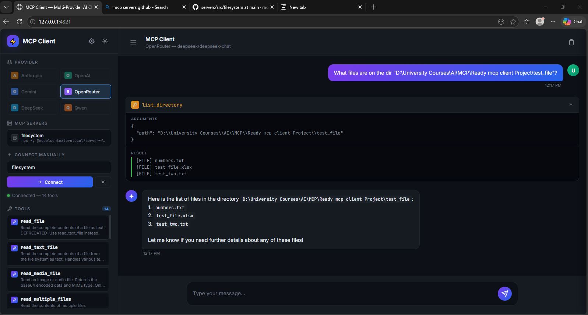

# Multi-Provider MCP Client

> A professional, modern web interface for chatting with AI models across multiple providers, featuring seamless integration with the Model Context Protocol (MCP) and secure per-user settings persistence.



---


## ✨ Features

- **Multi-Provider Support**: Seamlessly chat with leading AI models from:
  - Anthropic (Claude 3.5 Sonnet, Opus)
  - OpenAI (GPT-4o, o1, o3-mini)
  - Google Gemini (Gemini 2.5 Pro)
  - OpenRouter, DeepSeek, and Qwen
- **Model Context Protocol (MCP)**: Automatically discover and execute tools exposed by any connected MCP server (e.g., local filesystem, GitHub search, custom scripts).
- **Secure Authentication & Persistence**: 
  - Login / Signup functionality powered by a local SQLite database (`mcp_client.db`).
  - Hashed passwords and secure session cookies.
  - Complete isolation of user data: your API keys, favorite models, and custom MCP server configurations (`config.json` style) are securely stored and restored when you log in.
- **Premium Glassmorphism UI**: 
  - A beautiful, responsive interface with smooth transitions, blurred backdrops, and modern typography.
  - **Collapsible Sidebar**: Maximize your chat space with a single click.
  - **Sliding Drawers**: Manage your AI provider settings and raw JSON configurations in dedicated drawer panels.
- **Real-time WebSocket Chat**: Lightning-fast, bidirectional communication between the browser and the FastAPI backend.

---

## 🚀 Getting Started

### Prerequisites

- Python 3.10+
- [uv](https://docs.astral.sh/uv/) (Recommended) or `pip`

### Installation

1. **Clone the repository** (if applicable) and navigate to the project directory:
   ```bash
   cd Third_Project
   ```

2. **Install dependencies**:
   ```bash
   uv pip install -r requirements.txt
   # OR
   pip install -r requirements.txt
   ```
   *(Ensure you have FastAPI, Uvicorn, Websockets, Anthropic, OpenAI, Google-GenAI, etc., installed).*

3. **Configure Environment Variables** (Optional):
   You can provide default API keys in a `.env` file, though the UI allows you to safely input and store them per-user directly in the browser.
   ```env
   ANTHROPIC_API_KEY=your_key_here
   OPENAI_API_KEY=your_key_here
   ```

### Running the Server

Start the FastAPI application using `uv` (or `python` directly):

```bash
uv run python server.py
# OR
python server.py
```

The server will initialize the SQLite database (`mcp_client.db`) on startup.

**Access the UI** by opening your browser to:
[http://localhost:4321](http://localhost:4321)

---

## 💻 Usage

1. **Authenticate**: Create a new account on the Welcome screen.
2. **Configure AI Settings**: Click the **Sparkle (✨)** icon in the top right to open the AI Settings drawer. Input your API keys and select your preferred default models.
3. **Connect to MCP**: 
   - Enter the path to your MCP server script in the left sidebar and click "Connect".
   - Alternatively, use the **Config Editor (Dial)** icon to write raw JSON configuration (similar to Claude Desktop) and connect via pre-saved custom commands.
4. **Chat & Execute Tools**: Once connected, the client will fetch the available tools. Ask the AI to read files, search the web, or run scripts, and watch the MCP client execute the tools seamlessly.

---

## 🛠️ Architecture

- **Backend**: Python, FastAPI, Uvicorn, SQLite3
- **Frontend**: Vanilla JavaScript (ES6+), HTML5, CSS3 (No heavy frontend frameworks)
- **Protocol**: Model Context Protocol (MCP) over standard IO / SSE, wrapped in WebSockets for the browser.

**Built by:** Eng. Aymen Al-Tinah  
**Aymen's Labs**

---
*Built with ❤️ for modern AI development.*
